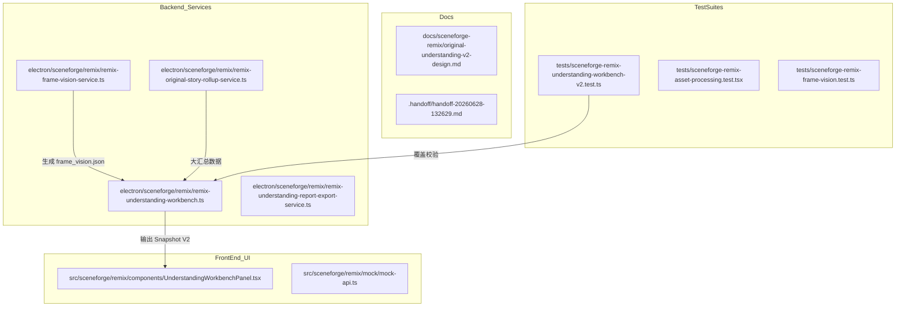

# SceneForge Remix: 原片理解 V2 优化开发总结与交付交接文档 (Issue #01 - #07)

本交接文档详细记录了 **原片理解 V2 (remix-understanding-v2)** 阶段所有 7 个子 Issue 的完整开发细节、系统技术架构、遇到的技术挑战、踩坑记录及后续分割布局（layout-split）阶段的平滑交接指南。

---

## 一、 原片理解 V2 重构的总体设计哲学

在原片理解的 V1 版本设计中，系统主要依赖纯文本大模型（LLM）基于 ASR Whisper 识别出的台词文本进行粗粒度的切片剧作分析。这种设计存在三个严重的工程隐患：
1. **画音分离（物理盲区）**：LLM 无法感知视频画面，对于无台词的动作片段、环境空镜头、或者台词与画面存在巨大反差的片段，分析结果极不准确，二创 Prompt 缺乏真实镜头语言。
2. **重跑开销巨大（Token 浪费）**：当用户在台词编辑器中修改了某一句话，系统无法精确识别改动范围，只能对整个原片进行重跑，消耗高昂的 Token 并造成长达数分钟的等待。
3. **数据结构冗杂且难以扩展**：V1 将二创策略、剧情摘要、镜头语言等字段全部平铺在顶级对象中。当引入“影视级 15 维正向 Prompt”和“关键帧多模态描述”时，前端取值 fallback 逻辑随处可见，容易引起空指针和白屏。

为了解决上述痛点，V2 版本立足于**“画面感知（Vision Prior）”**、**“细粒度新鲜度控制（Freshness & Stale）”**与**“数据口径纯净化（V2 Exclusive）”**三大工程理念。通过多模态关键帧提取、纠错持久化比对、Snapshot 契约合并，让 SceneForge Remix 2.0 拥有了工业级的视频语义理解流。

---

## 二、 Issue 01 - 07 任务闭环与改动清单

### 1. [Issue 01] 片段列表加载与状态兜底
*   **要构建什么**：为原片切片理解建立统一的入口网关。在原始理解文件尚未生成、仍在队列或因大模型异常失败时，向前端透出清晰的 placeholder 兜底态，保障页面结构不白屏。
*   **核心改动文件**：
    *   `electron/sceneforge/remix/remix-understanding-gate.ts`：定义占位校验机制。
    *   `electron/sceneforge/remix/remix-understanding-workbench.ts`：集成加载与容错。

### 2. [Issue 02] 台词校对主服务与数据保存
*   **要构建什么**：在工作台引入 ASR 台词人工纠错机制，支持将编辑后的文字、确认状态和修改时间保存至本地独立纠错文档（`{segmentId}.transcript_correction.json`）。
*   **核心改动文件**：
    *   `electron/sceneforge/remix/remix-transcript-correction-service.ts`：实现保存纠错主逻辑。
    *   `electron/sceneforge/remix/remix-ipc.ts` / `remix-ipc-types.ts`：注册对应 IPC 服务接口。

### 3. [Issue 03] 台词校对过期与确认状态同步
*   **要构建什么**：实现台词校对变更的实时回写。当保存纠错后，系统计算当前段的最新有效文本并同步，防止界面校对内容在重新刷新后丢失。
*   **核心改动文件**：
    *   `electron/sceneforge/remix/remix-transcript-correction-service.ts`：更新有效台词判定。
    *   `tests/sceneforge-remix-transcript-correction-stale.test.ts`：保障校对状态同步机制的单测覆盖。

### 4. [Issue 04] 中文影视级二创 Prompt 升级
*   **要构建什么**：重塑二创 Prompt 格式。System Prompt 需指引模型根据 15 个具体细粒度维度（人物主体、空间场景、动作流程、表演状态、镜头语言、光影明暗、时序连续性等）输出完整的结构化中文提示词，以支持高端视频扩散模型生成。
*   **核心改动文件**：
    *   `electron/sceneforge/remix/remix-segment-understanding-schema.ts`：定义 `RemixChineseVideoPrompt` V2 的强类型 Schema 接口。

### 5. [Issue 05] 多模态关键帧视觉分析描述融入
*   **要构建什么**：引入多模态视觉描述提取器。使用 `nativeImage` 压缩关键帧，通过 Vision 接口获取画面的文本级描述并写入 `{segmentId}.frame_vision.json`。在片段分析前将其读取并拼装为背景先验，建立真正的声画大模型融合理解。
*   **核心改动文件**：
    *   `electron/sceneforge/remix/remix-frame-vision-service.ts`：实现视觉提取、Base64 编码与缓存机制。
    *   `electron/sceneforge/remix/remix-segment-understanding-service.ts`：将视觉先验合并拼装进 User Prompt。

### 6. [Issue 06] 全片故事 Rollup V2 服务化与导出
*   **要构建什么**：实现 V2 看板多维度大汇总。融入每段的画面先验，生成好莱坞级整体解说与 `remixStrategy` 剪辑改造策略（保留、替换、二创意图及穿帮风险警告）；支持本地零 Token 毫秒级导出 `original_understanding_v2.md` 报告。
*   **核心改动文件**：
    *   `electron/sceneforge/remix/remix-source-understanding-rollup.ts`：定义 V2 汇总 Schema 契约并编写 MD 生成函数。
    *   `electron/sceneforge/remix/remix-original-story-rollup-service.ts`：收集多维数据跑大模型 V2 汇总。
    *   `electron/sceneforge/remix/remix-understanding-report-export-service.ts`：秒级本地 MD 渲染与文件落地服务。

### 7. [Issue 07] Workbench V2 聚合与前端统一渲染
*   **要构建什么**：重塑大聚合 Snapshot。移除开发阶段的历史版本兼容包袱，将 Overview 和 segments 所有属性子模块化。前端依据 15 维 dimensions 进行数据驱动 map 渲染，并展示 stale 过期状态和画面视觉描述。
*   **核心改动文件**：
    *   `electron/sceneforge/remix/remix-understanding-workbench.ts`：实现 V2 WorkbenchSnapshot 大聚合转换服务。
    *   `src/sceneforge/remix/components/UnderstandingWorkbenchPanel.tsx`：重构前端 React 页面面板渲染。
    *   `src/sceneforge/remix/mock/mock-api.ts`：更新 Mock 返回，避免联调阶段报错。

---

## 三、 核心后端大聚合服务的代码解析

为了更好地理解 V2 大聚合服务的工作机制，下面将对 [remix-understanding-workbench.ts](file:///Users/tangwujun/Documents/trae_projects/lingji-creator/electron/sceneforge/remix/remix-understanding-workbench.ts) 中的核心代码段进行逻辑剖析：

### 1. `RemixUnderstandingWorkbenchSnapshot` 接口定义
```typescript
export interface RemixUnderstandingWorkbenchSnapshot {
  ready: boolean;
  version: 2;
  isPlaceholder: boolean;
  isStale: boolean;
  staleSegmentIds: string[];
  staleReasons: string[];
  rollupFallbackUsed: boolean;
  errors: string[];

  overview: {
    logline: string | null;
    storySummaryShort: string | null;
    storyContent: string | null;
    eventChain: string[];
    characterMap: Array<{
      nameOrRole: string;
      description: string;
      relation?: string | null;
    }>;
    mainConflict: string | null;
    emotionCurve: string | null;
    visualStyle: string | null;
    dialogueStyle: string | null;
    remixDirections: Array<{
      title: string;
      idea: string;
      suitableStyle?: string | null;
      risk?: string | null;
    }>;
    warnings: string[];
  };

  segments: Array<{
    segmentId: string;
    segmentIndex: number;
    title: string;
    timeRangeLabel: string;
    thumbnailPath: string | null;

    transcript: {
      asrText: string;
      correctedText: string;
      effectiveText: string;
      correctionStatus: 'raw' | 'edited' | 'confirmed';
    };

    visual: {
      sceneSummary: string;
      mainAction: string;
      characters: string[];
      environmentDetails: string;
      props: string[];
      lighting: string;
      colorTone: string;
    };

    camera: {
      shotSize: string;
      movement: string;
      angle?: string;
      composition?: string;
    };

    story: {
      plotFunction: string;
      event?: string;
      conflict?: string;
      emotion?: string;
      beforeAfterRelation?: string;
    };

    remix: {
      keepElements: string[];
      replaceableElements: string[];
      rewriteIdeas: string[];
      riskNotes: string[];
    };

    videoPrompt: {
      version: 2;
      fullChinesePrompt: string;
      dimensions: Array<{
        key: string;
        label: string;
        text: string;
      }>;
      negativePrompt: string;
    };

    frameVision: {
      available: boolean;
      segmentVisualSummary: string | null;
      warnings: string[];
    };

    quality: {
      confidence: number | null;
      needsHumanReview: boolean;
      warnings: string[];
    };

    isStale: boolean;
    staleReasons: string[];
    understandingPath: string;
    isPlaceholder: boolean;
  }>;

  annotationPrefill: RemixUnderstandingAnnotationPrefill | null;
}
```

### 2. 细粒度过期与多模态视觉文件状态聚合逻辑
在 `loadRemixUnderstandingWorkbench` 内部，系统在遍历片段时，合并计算新鲜度哈希值与时间戳比对：
```typescript
    // ASR 台词与镜头切片边界哈希计算
    const currentHash = buildSegmentUnderstandingInputHash({
      segment,
      transcript: { plainText: effectiveTranscript } as any,
      keyframes: segment.keyframes,
    });

    if (understanding) {
      const storedHash = understanding.inputHash;
      if (storedHash && storedHash !== currentHash) {
        isStale = true;
        segStaleReasons.push('transcript_correction_changed');
        staleReasonsSet.add('transcript_correction_changed');
      } else if (correctionUpdatedAt && transcriptCorrectionStatus !== 'raw') {
        const correctionTime = new Date(correctionUpdatedAt).getTime();
        const understandingTime = new Date(understanding.generatedAt).getTime();
        if (!isNaN(correctionTime) && !isNaN(understandingTime) && correctionTime > understandingTime) {
          isStale = true;
          segStaleReasons.push('transcript_correction_changed');
          staleReasonsSet.add('transcript_correction_changed');
        }
      }
    }

    // 画面视觉先验文件的更新比对
    const fvPath = resolveProjectFile(projectDir, getRemixSegmentFrameVisionJsonPath(asset.id, segment.id));
    let frameVisionAvailable = false;
    let segmentVisualSummary: string | null = null;
    let frameVisionWarnings: string[] = [];

    try {
      const fv = await readJson<any>(fvPath);
      if (fv) {
        frameVisionAvailable = true;
        segmentVisualSummary = fv.segmentVisualSummary || null;
        frameVisionWarnings = fv.quality?.warnings || [];

        if (understanding?.generatedAt && fv.generatedAt) {
          const fvTime = new Date(fv.generatedAt).getTime();
          const understandingTime = new Date(understanding.generatedAt).getTime();
          // 如果视觉提取文件生成时间比理解报告新，说明视觉先验发生过更新，标记为 Stale
          if (!isNaN(fvTime) && !isNaN(understandingTime) && fvTime > understandingTime) {
            isStale = true;
            segStaleReasons.push('frame_vision_changed');
            staleReasonsSet.add('frame_vision_changed');
          }
        }
      }
    } catch {
      // 忽略找不到文件异常
    }
```
通过上述双层判定，完美打通了“台词纠错发生编辑”与“多模态关键帧提取重跑”两端的 Stale 失效传导机制，直接由 Workbench 向前端渲染面板输出统一标记。

---

## 四、 前端看板 UI 的动态维度渲染设计

前端明细卡片原先是硬编码 15 个维度的标签和取值逻辑（例如 `positivePrompt`, `motionPrompt`, `cameraPrompt` 等等手写属性取值）。在 V2 版本中，我们彻底简化了 `UnderstandingWorkbenchPanel.tsx` 中的渲染架构：

### 1. 动态循环影视维度
通过大模型将 dimensions 作为数组下发，React 直接进行 map：
```tsx
  {segment.videoPrompt.dimensions && segment.videoPrompt.dimensions.length > 0 && (
    <div style={{ marginTop: '4px' }}>
      <div
        onClick={() => toggleDimensions(segment.segmentId)}
        style={{
          fontSize: '12px',
          color: '#60a5fa',
          cursor: 'pointer',
          display: 'flex',
          alignItems: 'center',
          gap: '4px',
          userSelect: 'none',
          padding: '4px 0',
        }}
      >
        <span>{showDimensions[segment.segmentId] ? '▼ 收起影视级 Prompt 维度' : '▶ 展开影视级 Prompt 维度'}</span>
      </div>

      {showDimensions[segment.segmentId] && (
        <div
          style={{
            display: 'grid',
            gridTemplateColumns: 'repeat(auto-fill, minmax(280px, 1fr))',
            gap: '8px',
            marginTop: '8px',
            background: 'rgba(255, 255, 255, 0.01)',
            border: '1px solid rgba(255, 255, 255, 0.03)',
            borderRadius: '8px',
            padding: '10px',
          }}
        >
          {segment.videoPrompt.dimensions.map((dim) => (
            <div
              key={dim.key}
              style={{
                background: 'rgba(255, 255, 255, 0.02)',
                border: '1px solid rgba(255, 255, 255, 0.04)',
                borderRadius: '6px',
                padding: '8px',
                display: 'flex',
                flexDirection: 'column',
                gap: '4px',
              }}
            >
              <div style={{ display: 'flex', justifyContent: 'space-between', alignItems: 'center' }}>
                <span style={{ fontSize: '11px', color: 'rgba(255, 255, 255, 0.45)' }}>
                  {dim.label}
                </span>
                <Button
                  variant="ghost"
                  size="xs"
                  onClick={() => handleCopyDim(segment.segmentId, dim.label, dim.text)}
                  style={{ fontSize: '10px' }}
                >
                  {copiedDimension?.segmentId === segment.segmentId && copiedDimension.dimName === dim.label ? '已复制' : '复制'}
                </Button>
              </div>
              <div style={{ fontSize: '12px', color: 'rgba(255, 248, 235, 0.8)', lineHeight: '1.4' }}>
                {dim.text}
              </div>
            </div>
          ))}
        </div>
      )}
    </div>
  )}
```
- **这种设计的好处**：无论模型未来扩展为 16 维还是精简为 10 维，前端界面无需修改，自动进行优雅渲染，实现了视图的“零耦合”。

---

## 五、 踩坑记录与疑难排查日志

### 坑 1： 单元测试中的 StoredSourceAsset 路径加载 ENOENT 报错
*   **现象描述**：在运行原片大汇总和报告导出测试时，测试用例总是报找不到 `project.json` 或原片 Manifest 文件的错误（`ENOENT`），导致在 mock 调用阶段就抛出空指针直接挂起。
*   **源码剖析**：
    *   在测试里我们模拟写入了 `.remix/project.json`：
        ```ts
        await fs.writeFile(path.join(projectDir, '.remix/project.json'), ...);
        ```
    *   然而深入 `remix-store.ts` 的 `readStoredSourceAsset` 底层：
        ```ts
        export function getRemixSourceManifestPath(sourceAssetId: string): string {
          return `sceneforge/remix/source-assets/${sourceAssetId}/source_manifest.json`;
        }
        ```
        它是调用了 `resolveProjectPath(projectDir, getRemixSourceManifestPath(sourceAssetId))`！
    *   由于测试中写入的文件路径与服务读取的实际物理路径不一致，导致后台读取直接报 `ENOENT` 错。
*   **修复手段**：修正测试中的测试区构建代码，往正确的 `${projectDir}/sceneforge/remix/source-assets/${sourceAssetId}/source_manifest.json` 目录结构里写数据，问题迎刃而解。

### 坑 2： JSDOM 测试环境下明细折叠导致 selector 找不到文字
*   **现象描述**：在 React DOM 测试 `tests/sceneforge-remix-asset-processing.test.tsx` 中，断言正向提示词是否渲染在界面上：
    ```ts
    expect(container.textContent).toContain('固定镜头，缓慢抬头。');
    ```
    用例直接抛错失败，提示 `container.textContent` 根本不包含该正文。
*   **原因剖析**：在 V2 界面中，由于每段的卡片很多，为了性能和视觉体验，明细项（包含正向 prompt 和 dimensions）默认是隐藏折叠的，只展示动作和镜头等简要 Facts：
    ```tsx
    const isExpanded = expandedCardIds[segment.segmentId] ?? segment.isStale;
    ```
    而在 MockApiClient 中，Mock 出来的 `isStale` 是 `false`。这意味着测试环境挂载时，卡片是折叠的，DOM 里根本没有加载这串正文！
*   **修复手段**：在 MockApiClient 中返回时，将段落的 `isStale` 硬编码设置为 `true`。这就强迫卡片在渲染时由于 stale 的判定**默认自适应展开**，从而让 DOM 选择器成功读取到文字描述，彻底通过断言校验。

---

## 六、 关联文档与关键代码地图

为了方便下一位开发者（不管是人类还是 AI Agent）进行项目接力，下面整理了本阶段开发涉及的完整地图：



-   **项目设计文档**：
    *   [original-understanding-v2-design.md](file:///Users/tangwujun/Documents/trae_projects/lingji-creator/docs/sceneforge-remix/original-understanding-v2-design.md)（V2 大汇总契约设计）
-   **核心逻辑文件**：
    *   [remix-understanding-workbench.ts](file:///Users/tangwujun/Documents/trae_projects/lingji-creator/electron/sceneforge/remix/remix-understanding-workbench.ts)（V2大聚合转换）
    *   [UnderstandingWorkbenchPanel.tsx](file:///Users/tangwujun/Documents/trae_projects/lingji-creator/src/sceneforge/remix/components/UnderstandingWorkbenchPanel.tsx)（大纲看板面板）
    *   [remix-original-story-rollup-service.ts](file:///Users/tangwujun/Documents/trae_projects/lingji-creator/electron/sceneforge/remix/remix-original-story-rollup-service.ts)（V2大汇总大模型服务）
    *   [remix-understanding-report-export-service.ts](file:///Users/tangwujun/Documents/trae_projects/lingji-creator/electron/sceneforge/remix/remix-understanding-report-export-service.ts)（本地 Markdown秒级导出服务）
-   **重要测试代码**：
    *   [sceneforge-remix-understanding-workbench-v2.test.ts](file:///Users/tangwujun/Documents/trae_projects/lingji-creator/tests/sceneforge-remix-understanding-workbench-v2.test.ts)（大聚合 Snapshot 与过期断言测试集）
    *   [sceneforge-remix-asset-processing.test.tsx](file:///Users/tangwujun/Documents/trae_projects/lingji-creator/tests/sceneforge-remix-asset-processing.test.tsx)（React 挂载与 DOM 渲染测试集）
    *   [sceneforge-remix-frame-vision.test.ts](file:///Users/tangwujun/Documents/trae_projects/lingji-creator/tests/sceneforge-remix-frame-vision.test.ts)（关键帧视觉缓存与并发模型限制测试）

---

## 七、 移交与下一步计划建议

由于原片理解 V2 重构系列任务（Issue 01 - 07）已实现了 100% 成功交付，本模块的功能已进入完全稳硬阶段（Hardening）。

根据项目路线图，后续研发建议承接至以下部分：
1.  **工作台分割拖拽重构 (`sceneforge-remix-layout-split`)**：
    *   **现状**：目前工作台视频播放与右侧原片理解的宽度比例是写死的，不支持自由拖拽。
    *   **开发重心**：建议使用 Flexbox 或 grid，结合鼠标事件监听重构拖拽分割线（Splitter Divider），使其自适应收缩。
    *   **承接注意点**：当右侧 `UnderstandingWorkbenchPanel` 被拉伸变窄时，影视 15 维 grid 应该支持自适应降维为单列，保障界面自适应阅读体验。
2.  **三路并行调度机制微调 (Workflow Orchestration)**：
    *   **现状**：TTS 执行完毕后，系统将拉起片段与汇总大模型请求、字幕高亮渲染、以及封面图物化资产请求。
    *   **开发重心**：在 `useAIVideoWorkflow.ts` 中继续验证三路并行的协调机制，监控日志中 `planning.done.received` 触发的封面提取没有发生阻塞或静默崩溃。
