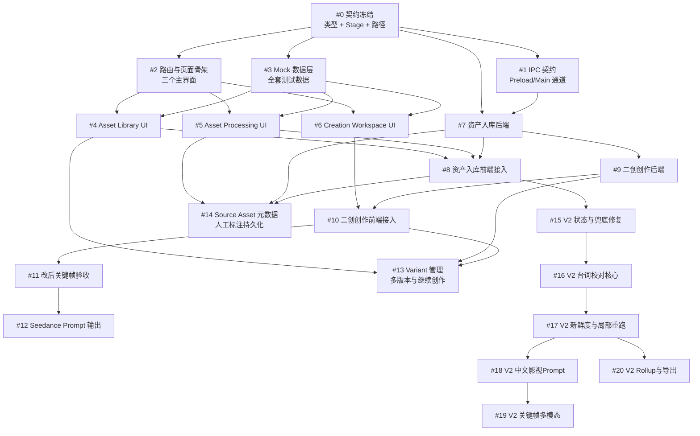

# SceneForge Remix Mode — Issues 拆解

> 源文档：[开发实施计划](file:///Users/tangwujun/Documents/trae_projects/lingji-creator/docs/sceneforge2.0/2026-06-22-sceneforge-remix-mode-development-plan.md)
> 拆解策略：**垂直切片（tracer bullet）**，每个 Issue 贯穿类型→后端→前端→测试全部层
> 辅助 Skill：`codebase-design`（架构契约）、`design-taste-frontend`（UI 表现）

---

## 依赖关系总览

## 并行执行建议

| 阶段 | 可并行执行的 Issues | 说明 |
|------|---------------------|------|
| Phase 0 | #0 | 基础，必须先完成 |
| Phase 0→1 过渡 | #1、#2、#3 | 三个可并行，都只依赖 #0 |
| Phase 1 | #4、#5、#6 | 三个 UI 可并行，都依赖 #2 + #3 |
| Phase 2 | #7 ‖ (等 #4 #5) → #8 | 后端 #7 可与 Phase 1 UI 并行 |
| Phase 3 | #9 → #10，并补 #13 | #13 补齐多 Variant 管理与继续创作 |
| Phase 2 补强 | #14 | #14 承接人工标注持久化与 Source Asset 元数据 |
| Phase 4 | #11 | 依赖 #10 |
| Phase 5 | #12 | 依赖 #11，且包含 Audio Plan 子结构 |
| Remix V2 Phase 1 | #15 | 原片理解状态反馈与 Rollup 兜底修复，依赖 #8 |
| Remix V2 Phase 2 | #16 → #17 | 台词校对持久化与前端展示，以及后续新鲜度过期机制 |
| Remix V2 Phase 3 | #18 | 中文影视级 14 维度 Prompt 升级与复制 |
| Remix V2 Phase 4 | #19 ‖ #20 | 关键帧多模态抽取（依赖 #18），以及 V2 Rollup 与 MD 导出（依赖 #17） |

---

## 详细 Issue 列表

具体各 Issue 的“要构建什么”、“验收标准”、“Code Review 检查项”与“Test 验证步骤”等详细内容，请参阅各个子目录下的 `task_plan.md`（V1）或 `.scratch/remix-understanding-v2/issues/`（V2）：

1. **Issue #0: 契约冻结** -> [.planning/tasks/remix-issue-00-contract-freeze/task_plan.md](file:///Users/tangwujun/Documents/trae_projects/lingji-creator/.planning/tasks/remix-issue-00-contract-freeze/task_plan.md)
2. **Issue #1: IPC 契约** -> [.planning/tasks/remix-issue-01-ipc-contract/task_plan.md](file:///Users/tangwujun/Documents/trae_projects/lingji-creator/.planning/tasks/remix-issue-01-ipc-contract/task_plan.md)
3. **Issue #2: 路由与页面骨架** -> [.planning/tasks/remix-issue-02-routing-skeleton/task_plan.md](file:///Users/tangwujun/Documents/trae_projects/lingji-creator/.planning/tasks/remix-issue-02-routing-skeleton/task_plan.md)
4. **Issue #3: Mock 数据层** -> [.planning/tasks/remix-issue-03-mock-data/task_plan.md](file:///Users/tangwujun/Documents/trae_projects/lingji-creator/.planning/tasks/remix-issue-03-mock-data/task_plan.md)
5. **Issue #4: Asset Library UI** -> [.planning/tasks/remix-issue-04-asset-library-ui/task_plan.md](file:///Users/tangwujun/Documents/trae_projects/lingji-creator/.planning/tasks/remix-issue-04-asset-library-ui/task_plan.md)
6. **Issue #5: Asset Processing UI** -> [.planning/tasks/remix-issue-05-asset-processing-ui/task_plan.md](file:///Users/tangwujun/Documents/trae_projects/lingji-creator/.planning/tasks/remix-issue-05-asset-processing-ui/task_plan.md)
7. **Issue #6: Creation Workspace UI** -> [.planning/tasks/remix-issue-06-creation-workspace-ui/task_plan.md](file:///Users/tangwujun/Documents/trae_projects/lingji-creator/.planning/tasks/remix-issue-06-creation-workspace-ui/task_plan.md)
8. **Issue #7: 资产入库后端** -> [.planning/tasks/remix-issue-07-asset-ingestion-backend/task_plan.md](file:///Users/tangwujun/Documents/trae_projects/lingji-creator/.planning/tasks/remix-issue-07-asset-ingestion-backend/task_plan.md)
9. **Issue #8: 资产入库前端接入** -> [.planning/tasks/remix-issue-08-asset-ingestion-frontend/task_plan.md](file:///Users/tangwujun/Documents/trae_projects/lingji-creator/.planning/tasks/remix-issue-08-asset-ingestion-frontend/task_plan.md)
10. **Issue #9: 二创创作后端** -> [.planning/tasks/remix-issue-09-creation-backend/task_plan.md](file:///Users/tangwujun/Documents/trae_projects/lingji-creator/.planning/tasks/remix-issue-09-creation-backend/task_plan.md)
11. **Issue #10: 二创创作前端接入** -> [.planning/tasks/remix-issue-10-creation-frontend/task_plan.md](file:///Users/tangwujun/Documents/trae_projects/lingji-creator/.planning/tasks/remix-issue-10-creation-frontend/task_plan.md)
12. **Issue #11: 改后关键帧验收** -> [.planning/tasks/remix-issue-11-edited-keyframe/task_plan.md](file:///Users/tangwujun/Documents/trae_projects/lingji-creator/.planning/tasks/remix-issue-11-edited-keyframe/task_plan.md)
13. **Issue #12: Seedance Prompt 输出** -> [.planning/tasks/remix-issue-12-seedance-prompt/task_plan.md](file:///Users/tangwujun/Documents/trae_projects/lingji-creator/.planning/tasks/remix-issue-12-seedance-prompt/task_plan.md)
14. **Issue #13: Variant 管理闭环** -> [.planning/tasks/remix-issue-13-variant-management/task_plan.md](file:///Users/tangwujun/Documents/trae_projects/lingji-creator/.planning/tasks/remix-issue-13-variant-management/task_plan.md)
15. **Issue #14: Source Asset 元数据闭环** -> [.planning/tasks/remix-issue-14-source-asset-metadata/task_plan.md](file:///Users/tangwujun/Documents/trae_projects/lingji-creator/.planning/tasks/remix-issue-14-source-asset-metadata/task_plan.md)

### Remix Understanding V2 优化阶段

16. **Issue #15: V2 状态与兜底修复** -> [.scratch/remix-understanding-v2/issues/01-status-fallback.md](file:///Users/tangwujun/Documents/trae_projects/lingji-creator/.scratch/remix-understanding-v2/issues/01-status-fallback.md)
17. **Issue #16: V2 台词校对核心** -> [.scratch/remix-understanding-v2/issues/02-transcript-correction-core.md](file:///Users/tangwujun/Documents/trae_projects/lingji-creator/.scratch/remix-understanding-v2/issues/02-transcript-correction-core.md)
18. **Issue #17: V2 新鲜度与局部重跑** -> [.scratch/remix-understanding-v2/issues/03-transcript-correction-stale-mechanism.md](file:///Users/tangwujun/Documents/trae_projects/lingji-creator/.scratch/remix-understanding-v2/issues/03-transcript-correction-stale-mechanism.md)
19. **Issue #18: V2 中文影视Prompt** -> [.scratch/remix-understanding-v2/issues/04-chinese-prompt-v2.md](file:///Users/tangwujun/Documents/trae_projects/lingji-creator/.scratch/remix-understanding-v2/issues/04-chinese-prompt-v2.md)
20. **Issue #19: V2 关键帧多模态** -> [.scratch/remix-understanding-v2/issues/05-keyframe-vision-multimodal.md](file:///Users/tangwujun/Documents/trae_projects/lingji-creator/.scratch/remix-understanding-v2/issues/05-keyframe-vision-multimodal.md)
21. **Issue #20: V2 Rollup与导出** -> [.scratch/remix-understanding-v2/issues/06-rollup-v2-and-export.md](file:///Users/tangwujun/Documents/trae_projects/lingji-creator/.scratch/remix-understanding-v2/issues/06-rollup-v2-and-export.md)

