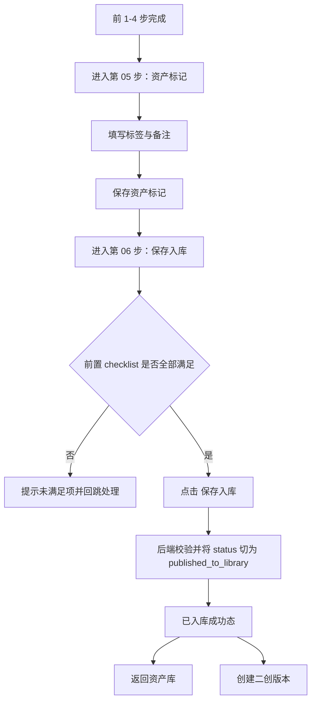
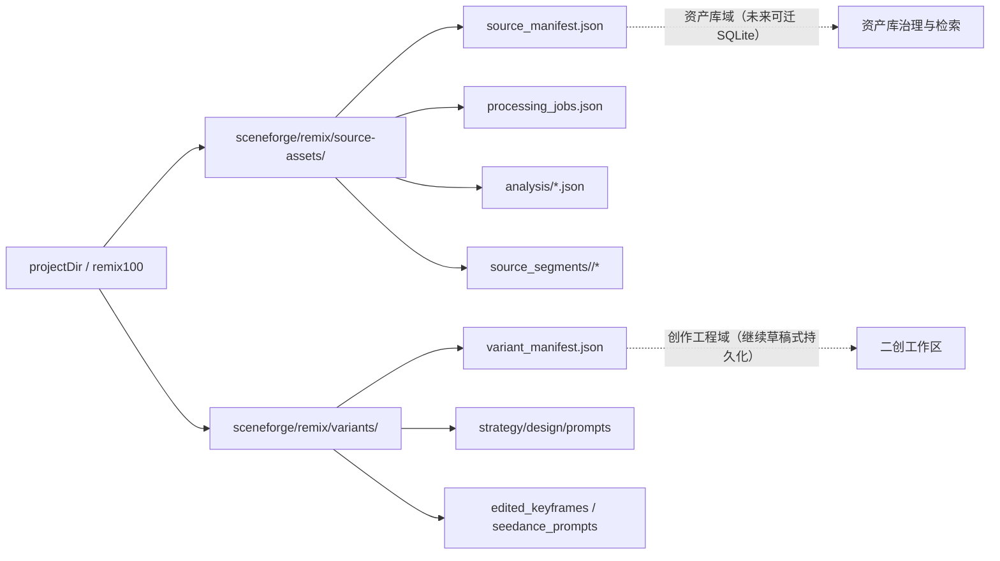

# SceneForge Remix 资产标记与保存入库阶段重构设计

- 日期：2026-06-30
- 状态：设计已确认，待评审 → PRD / 实施计划 / issues 拆分
- 适用范围：`SceneForge Remix` 原片资产处理工作台第 05 / 06 步
- 关联文档：
  - `docs/sceneforge-remix/source-understanding-design-and-implementation-plan.md`
  - `docs/sceneforge-remix/original-understanding-v2-design.md`
  - `.handoff/handoff-20260629-194649.md`

## 1. 背景与问题定义

当前 `SceneForge Remix` 的原片资产处理工作台已经形成 6 步主流程：

1. 导入原片
2. 真实镜头切片
3. 关键帧提取
4. 原片理解
5. 人工标注
6. 保存入库

经对照当前代码、handoff 和页面现状，存在以下结构性问题：

### 1.1 第 05 步“人工标注”的对象粒度错误

当前页面与交互将“人工标注”表达成片段级工作台，包括：

- 当前播放片段
- 某个 segment 的标题、时长、时间范围
- 基于片段理解结果生成的大段“保留/替换建议”

但现有持久化模型里，第 05 步真正保存的只是 `SourceAsset` 上的资产级字段：

- `tags`
- `annotationNote`
- `lastAnnotatedAt`
- `annotatedBy`
- `annotationSource`

也就是说：

- **现有数据模型是资产级**
- **现有 UI 却在表达片段级**

这会让用户误以为这里承担“逐片段人工修订”职责，形成错误心智。

### 1.2 第 06 步“保存入库”的语义被片段视角污染

当前第 06 步页面仍会展示“当前播放片段”等片段级信息，但实际后端 `publishSourceAssetToLibrary` 的行为非常轻量，核心只是：

1. 校验前置门禁
2. 将 `sourceAsset.status` 切换为 `published_to_library`
3. 回写 `source_manifest.json`

也就是说：

- **第 06 步本质是资产级状态确认**
- **不是片段级复核页面**
- **不是新的理解分析步骤**

### 1.3 第 05 / 06 步的交互关系不够清晰

当前用户会遇到两个问题：

- 第 05 步看起来像“还在做片段级工作”
- 第 06 步看起来像“又回到片段工作台继续看段落”

导致用户难以理解：

- 第 05 步到底是在修 segment，还是在给整条资产补资料
- 第 06 步到底是在做什么确认

### 1.4 当前持久化模型适合继续沿用，但必须收紧语义

现有 Remix 持久化方式已经具备清晰雏形：

- `source_manifest.json` 作为 source asset 主文档
- `variant_manifest.json` 作为 variant 主文档
- 原片理解、segment understanding、transcript、audio 等作为独立 JSON/文件产物
- Snapshot 作为运行时拼装视图，不单独写盘

这套模式在当前阶段适合继续沿用，但必须：

- 避免 UI 继续违背现有数据模型
- 避免资产级字段被当成片段级标注容器
- 提前收紧 JSON 结构化约束，为未来 SQLite 迁移预留边界

## 2. 设计目标

本次重构目标如下：

### 2.1 产品目标

- 将第 05 / 06 步统一切换为**资产级语义**
- 将第 05 步正式改名为 `资产标记`
- 将第 06 步正式定义为 `保存入库`
- 让用户清楚区分：
  - 第 05 步负责补充资产级信息
  - 第 06 步负责确认资产进入可复用资产库

### 2.2 交互目标

- 左侧导航保留 6 步结构，不打散大流程
- 第 05 / 06 步不再展示片段级卡片或“当前播放片段”
- 第 06 步成为最终收口页，展示：
  - 前置 checklist
  - 资产标记摘要
  - 显式 `保存入库` 按钮

### 2.3 模型目标

- 不重造核心持久化模型
- 继续以 `SourceAsset` 作为资产库域核心实体
- 继续在 `SourceAsset` 上保存资产标签与备注
- 继续以 `published_to_library` 表达“已入库”状态

### 2.4 持久化目标

- 本期继续采用 JSON / 文件目录持久化
- 所有资产库关键数据必须有结构化 JSON 表达
- 后续仅资产库域迁移 SQLite
- `Variant / 二创工程域` 与 `SceneForge 草稿域` 继续保持当前草稿式持久化

## 3. 非目标

本次设计明确不包含以下内容：

- 不重构前 1-4 步（导入、切片、关键帧、原片理解）的主流程
- 不在本期引入 SQLite
- 不重构 `Variant` 的草稿式持久化方式
- 不重构 `SceneForge` 创作工程域
- 不为第 05 步引入新的片段级人工标注系统
- 不为历史资产批量清洗旧 `annotationNote`
- 不在本期实现复杂资产检索系统
- 不在本期引入自动入库或隐式入库

## 4. 当前实现现状

本节仅基于现有仓库代码整理，不新增概念。

### 4.1 当前真实持久化对象

当前 Remix 持久化核心有 3 类 document：

1. `StoredSourceAssetDocument`
2. `StoredSourceAssetProcessingJobsDocument`
3. `StoredVariantDocument`

其中：

- `StoredSourceAssetDocument`
  - `schema`
  - `version`
  - `sourceAsset`
  - `processingStageStates`
- `StoredSourceAssetProcessingJobsDocument`
  - `schema`
  - `version`
  - `sourceAssetId`
  - `jobs`
- `StoredVariantDocument`
  - `schema`
  - `version`
  - `variant`
  - `creationStageStates`
  - `keyframeEditPrompts`
  - `editedKeyframes`
  - `seedancePrompts`

### 4.2 当前核心实体

#### SourceAsset

`SourceAsset` 是原片资产基底主模型，承担：

- 原片身份
- 原视频与分析产物路径引用
- segment 列表
- 资产级 tags / note
- 入库状态
- variantCount

关键字段：

- `id`
- `title`
- `status`
- `createdAt`
- `updatedAt`
- `sourceVideoPath`
- `sourceManifestPath`
- `transcriptPath`
- `srtPath`
- `sourceOverviewMarkdownPath`
- `sourceOverviewJsonPath`
- `segmentAnalysisMarkdownPath`
- `segmentAnalysisJsonPath`
- `sourceAudioPath`
- `sourceAudioJsonPath`
- `segments`
- `segmentationMode`
- `segmentationDiagnostics`
- `manualSegmentationOverride`
- `mediaValidation`
- `variantCount`
- `tags`
- `annotationNote`
- `lastAnnotatedAt`
- `annotatedBy`
- `annotationSource`

#### SourceSegment

`SourceSegment` 是挂在 `SourceAsset` 下的片段级结构，负责承载：

- 时间边界
- 片段 clip
- 关键帧索引
- segment understanding / transcript / audio 的路径

#### RemixVariant

`RemixVariant` 是基于已入库 `SourceAsset` 派生出的二创版本主模型，负责：

- variant 基础配置
- retention matrix
- creation stage 状态
- strategy / design 产物路径引用

### 4.3 当前目录结构

当前目录结构可抽象为：

```text
sceneforge/remix/
  source-assets/
    <sourceAssetId>/
      source_manifest.json
      processing_jobs.json
      analysis/
      debug/
      audio/
      transcripts/
      source_segments/
        <segmentId>/
          source_clip.mp4
          segment_understanding.json
          transcripts/
          audio/
  variants/
    <variantId>/
      variant_manifest.json
      remix_strategy.md
      remix_strategy.json
      global_design.md
      global_design.json
      segment_adaptations/
      segment_design_overrides/
      keyframe_prompts/
      edited_keyframes/
      seedance_prompts/
      prompt_bundle/
```

### 4.4 当前第 05 / 06 步真实后端行为

#### 第 05 步：资产元数据更新

当前第 05 步本质只是在调用：

- `updateSourceAssetMetadata`

更新内容为：

- `tags`
- `annotationNote`
- `lastAnnotatedAt`
- `annotatedBy`
- `annotationSource`
- `updatedAt`

#### 第 06 步：状态切换

当前第 06 步点击“保存入库”后，本质只是在调用：

- `publishSourceAssetToLibrary`

后端行为为：

1. 读取 `StoredSourceAssetDocument`
2. 执行 `assertPublishReady`
3. 将 `sourceAsset.status = published_to_library`
4. 更新 `updatedAt`
5. 回写 `source_manifest.json`
6. 返回最新 snapshot

### 4.5 当前实现的主要问题总结

1. 第 05 步是资产级数据写入，但 UI 表达成片段级标注
2. 第 06 步是资产级状态切换，但 UI 表达成片段复核工作台
3. `annotationNote` 当前在产品上被滥用成片段级说明容器
4. 用户界面中的“人工标注”命名持续强化错误心智

## 5. 目标流程设计

### 5.1 阶段重定义

第 05 / 06 步重定义如下：

- 第 05 步：`资产标记`
- 第 06 步：`保存入库`

### 5.2 第 05 步职责

第 05 步 `资产标记` 只做两件事：

1. 为整条 source asset 添加标签
2. 为整条 source asset 填写资产级备注

不再承担：

- 片段级保留/替换修正
- 某一段的动作/镜头修订
- segment review

### 5.3 第 06 步职责

第 06 步 `保存入库` 只做三件事：

1. 展示前置门禁 checklist
2. 展示资产标记摘要
3. 让用户显式点击 `保存入库`

它本质是：

- 资产级确认页
- 不是片段级工作台
- 不是新的分析步骤

### 5.4 两步之间的关系

采用如下设计：

- 左侧导航保留两步语义
- 第 05 步负责编辑
- 第 06 步负责确认
- 第 06 步提供“编辑资产标记”回跳入口
- 最终由第 06 步统一收口

### 5.5 主流程



### 5.6 异常分支

#### 资产标记保存失败

- 保留用户输入
- 不切换完成态
- 页面展示错误并允许重试

#### 保存入库门禁失败

- 页面停留在第 06 步
- 刷新 checklist
- 显示真实未满足项
- 提供回跳入口

#### 保存入库写盘失败

- 不进入成功态
- 保持当前页
- 展示错误信息
- 允许重试

## 6. 前端 UI 改造设计

### 6.1 左侧导航

左侧导航保留 6 步，但文案调整为：

1. 导入原片
2. 真实镜头切片
3. 关键帧提取
4. 原片理解
5. 资产标记
6. 保存入库

第 05 步副标题：

- `为整条素材补充标签与备注`

第 06 步副标题：

- `确认这份素材进入可复用资产库`

### 6.2 第 05 步页面结构

第 05 步页面仅保留 3 个区块：

#### 区块 1：资产概览卡

展示：

- 资产标题
- 原视频时长
- 镜头段数量
- 关键帧数量
- 原片理解状态
- 当前资产状态

#### 区块 2：资产标签编辑区

展示：

- 标签输入框
- 已添加标签列表
- 添加 / 删除动作

#### 区块 3：资产备注编辑区

展示：

- 单个 textarea
- 用于填写资产级人工判断

#### 主操作

按钮：

- `保存资产标记`

成功提示：

- `资产标记已保存，可继续执行保存入库`

### 6.3 第 05 步必须删除的内容

第 05 步页面必须删除：

- 当前播放片段
- 当前片段标题 / 时长 / 起止时间
- 片段级保留/替换说明大段文本
- 基于片段理解灌入 `annotationNote` 的大段逐条建议
- 任何 segment workbench 风格卡片

### 6.4 第 06 步页面结构

第 06 步页面保留 4 个区块：

#### 区块 1：入库说明卡

说明：

- 这份素材前置处理已经完成
- 保存入库后可进入资产库
- 后续可基于其创建二创版本

#### 区块 2：前置检查清单

展示以下项：

- 原片已登记
- 真实镜头切片已确认
- 关键帧已抽取
- 原片理解已整理
- 资产标记已保存

每项包含：

- 名称
- 状态：已满足 / 未满足
- 一句说明

#### 区块 3：资产标记摘要

展示：

- 当前标签
- 当前备注
- 最近保存时间

同时提供次级动作：

- `编辑资产标记`

点击后回到第 05 步。

#### 区块 4：最终确认区

展示：

- 主按钮：`保存入库`
- 当前状态说明

按钮状态：

- 前置未满足：禁用，文案 `前置步骤未完成`
- 提交中：`保存中…`
- 可提交：`保存入库`
- 成功后：替换为完成态

### 6.5 第 06 步必须删除的内容

第 06 步页面必须删除：

- 当前播放片段
- 当前 segment 卡片
- 某个片段的起止时间和时长展示
- 与视频预览联动的片段详情区
- 将“最近完成：单段理解任务完成”当作页面主信息

### 6.6 成功态

保存入库成功后显示：

- `已入库` badge
- 说明：`这份素材已进入可复用资产库`
- 两个后续动作：
  - `返回资产库`
  - `创建二创版本`

## 7. 数据模型与 JSON 约束

### 7.1 持久化总策略

本期采用以下总策略：

- `Source Asset / 资产库域`：继续使用结构化 JSON 持久化
- `Variant / 二创工程域`：继续使用当前草稿式文档持久化
- `SceneForge 草稿工程域`：继续使用当前草稿式持久化
- 所有未来希望进入资产库检索/管理的关键数据，必须有稳定 JSON 表达

### 7.2 领域分层

#### 资产库域

包含：

- source asset 主信息
- source segments 索引
- keyframe 索引
- 原片理解摘要
- 资产标签与备注
- 入库状态

后续可迁移到 SQLite。

#### 创作工程域

包含：

- variant
- strategy
- design
- keyframe prompts
- edited keyframes
- seedance prompts

本期不纳入数据库设计。

### 7.3 SourceAsset 继续作为资产库核心实体

本期保留 `SourceAsset` 作为资产库域核心实体，不新增独立资产库主表文档。

`SourceAsset` 继续承担：

- 原片资产主身份
- 原片级 / 片段级路径挂接
- 资产级 tags / note
- 入库状态
- variantCount

### 7.4 资产标记字段继续直接挂在 SourceAsset

本期不新增独立 `asset_marking.json`。

第 05 步继续直接写回：

- `sourceAsset.tags`
- `sourceAsset.annotationNote`
- `sourceAsset.lastAnnotatedAt`
- `sourceAsset.annotatedBy`
- `sourceAsset.annotationSource`

### 7.5 字段语义重定义

以下字段产品语义必须明确：

#### `tags`

- 表示资产库检索标签
- 只表达整条资产级分类信息
- 不表达某个片段局部修订

#### `annotationNote`

- 表示资产级备注
- 用于记录对整条资产的人工判断
- 不再鼓励写成 segment 逐条说明清单

#### `published_to_library`

- 表示 source asset 已进入可复用资产库
- 不代表创建了新的独立“库条目文档”
- 不代表复制出另一份 source asset

### 7.6 JSON 层约束

#### 主文档最小化

`source_manifest.json` 只存：

- 元数据
- 状态
- 路径引用
- 资产级 metadata
- 少量摘要

不存：

- 大段理解正文
- 面向 UI 的拼装内容

#### 正文外置

大内容继续留在独立 JSON / Markdown：

- `source_overview.json`
- `segment_analysis.json`
- `original_understanding.json`
- `segment_understanding.json`

#### JSON 优先

凡是未来希望可检索、可迁 SQLite 的内容，必须优先存在 JSON 结构，不依赖 Markdown 自由文本。

## 8. 接口与状态机设计

### 8.1 本期继续复用的接口

#### 资产级 metadata 更新

- `updateSourceAssetMetadata`

职责：

- 更新 `tags`
- 更新 `annotationNote`
- 更新 `lastAnnotatedAt`
- 更新 `annotatedBy`
- 更新 `annotationSource`
- 更新 `updatedAt`

#### 资产级状态确认

- `publishSourceAssetToLibrary`

职责：

- 校验前置门禁
- 将 `sourceAsset.status` 切换为 `published_to_library`
- 更新 `updatedAt`
- 回写 source manifest

### 8.2 第 05 步页面读写字段

#### 页面读取

读取：

- `sourceAsset.id`
- `sourceAsset.title`
- `sourceAsset.status`
- `sourceAsset.updatedAt`
- `sourceAsset.videoMetadata.durationMs`
- `sourceAsset.segments.length`
- `sourceAsset.variantCount`
- `sourceAsset.tags`
- `sourceAsset.annotationNote`
- `sourceAsset.lastAnnotatedAt`
- `sourceAsset.annotatedBy`
- `sourceAsset.annotationSource`

#### 页面写入

写入：

- `tags`
- `annotationNote`

#### 页面不再消费

不再作为主呈现输入：

- `activePreviewSegment`
- `selectedSegmentId`
- `previewCurrentTimeMs`
- `understandingWorkbench` 的 segment 级内容

### 8.3 第 05 步完成态

本期建议：

- 至少保存 1 个标签
- 不存在未保存改动

备注建议填写，但不再作为硬完成条件。

### 8.4 第 06 步页面读写字段

#### 页面读取

读取：

- `processingStageStates.remix_source_import`
- `processingStageStates.remix_segmentation`
- `processingStageStates.remix_keyframes`
- `processingStageStates.remix_understanding`
- `sourceAsset.tags`
- `sourceAsset.annotationNote`
- `sourceAsset.lastAnnotatedAt`
- `sourceAsset.status`

#### 页面写入

点击 `保存入库` 时，不新增 metadata 写入。

本期只写：

- `sourceAsset.status = published_to_library`
- `sourceAsset.updatedAt`

### 8.5 第 06 步门禁规则

前端预判 `canPublish` 建议定义为：

- 原片导入完成
- 真实镜头切片完成
- 关键帧提取完成
- 原片理解完成
- 至少已保存 1 个标签
- 当前没有未保存的资产标记改动

后端真门禁继续由 `assertPublishReady` 负责。

### 8.6 本期应废弃或降级的逻辑

#### 废弃

- 第 05 / 06 步中的“当前播放片段”展示
- 第 05 / 06 步中的 segment 详情卡
- `人工标注` 的产品命名

#### 降级

- 基于 understanding 自动生成的大段逐片段 prefill 文本

本期最多可保留为：

- 推荐标签候选的来源

不再直接灌入备注 textarea。

## 9. 持久化策略与长期演进

### 9.1 本期策略

本期继续采用 JSON 文档持久化。

原因：

- 资产输出结构仍在调整
- JSON 更适合快速迭代 schema
- 方便直接根据 JSON 反向生成未来数据模型

### 9.2 未来迁移策略

未来当以下条件满足后，再考虑迁移 SQLite：

- 资产库字段基本稳定
- 入库、检索、筛选闭环已验证可用
- 二创主流程已跑通

### 9.3 SQLite 迁移范围

未来 SQLite 仅覆盖：

- 资产库域

不覆盖：

- variant 草稿工程域
- SceneForge 草稿工程域

### 9.4 未来数据库优先承接的实体

建议未来数据库化时优先承接：

- `assets`
- `asset_tags`
- `asset_segments`
- `asset_keyframes`
- `asset_notes`
- `asset_processing_status`

### 9.5 当前 JSON 必须可映射未来数据库

因此本期 JSON 约束必须保证：

- 字段命名稳定
- 关系键明确
- 结构化信息不埋在自由文本里
- 资产库主语义只留在 `SourceAsset` 域

## 10. 实施边界与拆分建议

### 10.1 本期包含

- 左侧导航第 05 / 06 步文案整改
- 第 05 步页面重构为资产级标记页
- 第 06 步页面重构为资产级入库确认页
- 去除第 05 / 06 步片段级主展示
- 调整 `canPublish` 与 checklist
- 调整 `annotationNote` 的产品语义
- 明确保留 JSON 主持久化策略

### 10.2 本期不包含

- 重构前 1-4 步页面
- 引入 SQLite
- 重构 variant 工作区
- 历史资产批量清洗
- 高级资产检索能力

### 10.3 推荐后续 issue 拆分

1. UI 文案与导航整改
2. 第 05 步资产标记页重构
3. 第 06 步保存入库页重构
4. `canPublish` / checklist / validator 调整
5. understanding prefill 降级或移除
6. mock / tests / docs 同步

## 11. 风险与兼容性

### 11.1 旧 `annotationNote` 内容兼容

历史项目中 `annotationNote` 可能已写成片段级长文本。

本期策略：

- 不主动重写旧数据
- 页面继续可读
- 新 UI 不再引导用户继续按片段级方式追加

### 11.2 旧命名兼容

本期要求：

- 用户界面统一采用 `资产标记`
- 底层字段仍可继续使用 `annotation*` 命名

### 11.3 门禁放宽的测试影响

若将“备注必填”调整为“备注建议填写”，需要同步：

- 前端状态逻辑
- 后端 validator
- 测试断言

### 11.4 第 05 / 06 步重复感风险

保留两步语义可能让用户觉得重复。

缓解方式：

- 第 05 步强调编辑
- 第 06 步强调确认
- 第 06 步只展示摘要，不再放完整编辑表单

## 12. 验收标准

### 12.1 功能验收

1. 左侧第 05 步显示为 `资产标记`
2. 左侧第 06 步显示为 `保存入库`
3. 第 05 步页面只出现资产级标签和备注编辑
4. 第 05 / 06 步页面均不再出现片段级主展示
5. 第 06 步正确展示 checklist 与资产标记摘要
6. 当前置满足时，`保存入库` 按钮可点击
7. 点击后 source asset 状态切换为 `published_to_library`
8. 入库成功后可直接返回资产库或创建二创版本

### 12.2 数据验收

9. 第 05 步保存后，仅更新 `SourceAsset` 上的资产级 metadata 字段
10. 第 06 步保存入库后，不创建新的独立入库文档，只更新 source manifest 状态
11. 旧项目可正常打开，旧备注内容可读
12. 资产库关键数据继续以 JSON 持久化

### 12.3 体验验收

13. 用户能明确区分：
    - 第 05 步是补充资产信息
    - 第 06 步是确认入库
14. 页面不再混淆资产级与片段级心智
15. 入库完成后的后续动作清晰

## 13. 关键原则

1. 第 05 / 06 步都只处理整条 `SourceAsset`
2. 第 05 步只负责资产级标签与备注
3. 第 06 步是显式确认动作，不自动入库
4. 本期继续使用结构化 JSON 持久化
5. 后续 SQLite 只覆盖资产库域
6. `Variant` 与 `SceneForge` 草稿域继续保持草稿式持久化
7. 所有未来希望进入资产库治理的数据，必须优先有 JSON 表达

## 14. 附图：数据边界



## 15. 结论

本设计确认以下最终结论：

- 第 05 步从“人工标注”重定义为“资产标记”
- 第 06 步从“片段感知页面”重构为“资产级保存入库确认页”
- 继续以 `SourceAsset` 作为资产库域核心实体
- 本期继续使用 JSON 作为主持久化格式
- 未来仅资产库域迁移 SQLite
- `Variant` 与 `SceneForge` 继续保持草稿式持久化

这份文档作为后续 PRD、实施计划与 issue 拆分的上游设计基线。
