# Remix 素材处理工作台 UI 布局优化方案

本方案旨在对 SceneForge Remix 素材处理工作台（[RemixAssetProcessing.tsx](file:///Users/tangwujun/Documents/trae_projects/lingji-creator/src/sceneforge/remix/pages/RemixAssetProcessing.tsx)）的中间栏布局进行结构化重构，解决由于垂直滚动导致的**视频播放器滚出视口、操作面板占用空间过大、界面信息松散**等痛点。

---

## 1. 核心设计初衷与布局对比

### 1.1 现状痛点分析
- **播放器容易滚出视口**：当前视频播放器与下方步骤面板（切片表格、关键帧网格、剧情文本等）共享同一滚动区域。当用户翻看几十个切片或长文本时，必须向上回滚才能看到视频画面，极大降低了校准效率。
- **界面重复信息较多**：每个处理步骤（如真实镜头切片、关键帧提取、原片理解）的面板内部都包含大块的“标题栏”和“阶段描述性文本”，占用了宝贵的首屏操作高度。
- **空间利用率低**：视频播放器与下方表单完全垂直堆叠，没有充分利用桌面端宽屏的水平展示空间。

### 1.2 优化后布局目标
将中间栏（主工作区）拆分为**上下分层视口（4:6 比例）**：
- **上半部分 (Top Section，占 40% 屏幕高度，置顶固定，不随滚轮滚动)**：
  - **左侧 (55% 宽度)**：视频预览播放器（纯播放器本身及播放进度条）。
  - **右侧 (45% 宽度)**：原片元数据、当前选中片段的信息（台词/时长/状态），以及当前激活步骤的标题、描述文字、状态 Chip 和全局系统提示。
- **下半部分 (Bottom Section，占 60% 屏幕高度，独立滚动区，`overflow-y: auto`)**：
  - 各步骤的交互面板主体（切片运行及表格、Timeline、关键帧画廊、剧情文本区、标注编辑器、保存入库清单等），移除原面板内冗余的头部标题和描述。

---

## 2. 界面布局示意图 (Wireframe & Flows)

### 2.1 整体版式拓扑 (Layout Topology)

```mermaid
graph TD
    subgraph UI_Shell ["Remix 资产处理工作台"]
        direction LR
        LeftNav["左侧步骤导航栏 <br/> (01 - 06 垂直轨)"]
        
        subgraph MiddleMain ["中间主工作区 (flex-direction: column)"]
            subgraph UpperSticky ["上半部分 (高度占比 40%, Sticky 置顶)"]
                direction LR
                UpperLeft["左侧: 视频预览视口 <br/> (播放器 + 播放进度)"]
                UpperRight["右侧: 信息融合区 <br/> (当前步骤说明/视频元数据/当前片段文本)"]
            end
            
            subgraph LowerScrollable ["下半部分 (高度占比 60%, overflow-y: auto)"]
                StepOperation["核心操作区域 <br/> (切片网格/Timeline/关键帧画廊/标注编辑表单)"]
            end
        end
    end
    
    style LeftNav fill:#1a1d24,stroke:#3b4252,stroke-width:1px
    style UpperSticky fill:#1e222b,stroke:#8fbcbb,stroke-width:2px
    style LowerScrollable fill:#14161d,stroke:#5e81ac,stroke-width:2px
    style StepOperation fill:#161920,stroke:#4c566a,stroke-width:1px
```



### 2.2 视觉排版细节预览

```
+------------------------------------------------------------------------------------+
|  [01] 导入原片   |  工作台顶栏: 素材标题 [华强买瓜] (可入库/待保存)                 [返回资产库]  |
|                 +------------------------------------------------------------------+
|  [02] 真实切片   |  [ 上半部分 (40% 高度 - 固定置顶) ]                                |
|  (已完成)       |  +--------------------------------+----------------------------+  |
|                 |  |                                | [步骤 02] 真实镜头切片 [已完成]|  |
|  [03] 关键帧     |  |         [ 视频播放器 ]         | 保护原始边界，决定合并/拆分 |  |
|  (已完成)       |  |                                | -------------------------- |  |
|                 |  |                                | [当前片段 06] - 快速反应     |  |
|  [04] 原片理解   |  | 0:37 / 2:04                    | 台词: "这瓜多少钱一斤..."    |  |
|  (待确认)       |  +--------------------------------+----------------------------+  |
|                 +------------------------------------------------------------------+
|  [05] 人工标注   |  [ 下半部分 (60% 高度 - 独立滚动区) ]                               |
|                 |  +------------------------------------------------------------+  |
|  [06] 保存入库   |  | (o) 快速模式   ( ) 高精模式   [ 运行切片 ]    [x] 保留人工校准  |  |
|                 |  | [合并当前段]   [在播放点拆分]   [确认当前边界]                    |  |
|                 |  | ====================[ 镜头段 Timeline ]===================== |  |
|                 |  | #01 0:00-0:10 (10s) | #02 0:10-0:20 (10s) | #03 0:20-0:37 ...|  |
|                 |  | ---------------------------------------------------------- |  |
|                 |  | [ 片段列表数据表格 (支持大数据量长滚动) ]                       |  |
|                 |  +------------------------------------------------------------+  |
+------------------------------------------------------------------------------------+
```

---

## 3. 各阶段功能模块划分 (Stage Detail Reorganization)

为实现上半部分右侧（信息融合区）与下半部分（操作功能区）的清晰拆分，各处理阶段的重组规划如下：

| 处理阶段 | 上半部分右侧显示内容 (Stage Info / Current Clip) | 下半部分滚动操作内容 (Main Operations) |
| :--- | :--- | :--- |
| **01 导入原片** | - 阶段标题：导入原片与元数据登记<br/>- 阶段描述及当前文件的分辨率、帧率<br/>- 导入状态标签（Chip） | - 源文件绝对路径和压缩路径卡片<br/>- 语音转写/字幕文件的文件路径卡片 |
| **02 真实镜头切片** | - 阶段标题：真实镜头切片<br/>- 当前步骤状态和运行结果诊断简报<br/>- 当前定位的片段详情（编号、时长、边界置信度、推荐策略） | - 切片配置栏（快速/高精模式切换、最小长度下拉框、重跑切片按钮、保留人工校准勾选）<br/>- 片段操作工具栏（合并、拆分、确认按钮）<br/>- 可视化片段 Timeline 轨<br/>- 详细切片列表数据表格 |
| **03 关键帧提取** | - 阶段标题：关键帧提取<br/>- 描述：批量提取每个片段的 First/Middle/Last 帧<br/>- 提取状态、提取数量汇总 | - 提取控制栏（中间帧提取阈值输入框、一键提取按钮）<br/>- 关键帧画廊网格（支持各片段首帧、中帧、尾帧的大图滚动与删除/重新提取） |
| **04 原片理解** | - 阶段标题：原片理解<br/>- 阶段总进度反馈（如 "正在生成理解... 12/26 段"）<br/>- 当前播放帧对应片段的 AI 剧情摘要、镜头运动、台词文本 | - 一键生成/重跑原片理解的触发按钮<br/>- 全局剧情线摘要、情绪曲线文本卡片<br/>- 原片理解 Workbench 卡片面板（多段落合并预览与 Video Prompt 快速复制区） |
| **05 人工标注** | - 阶段标题：人工标注与细节修正<br/>- 预填建议的来源与当前标注完整度提示 | - 标签输入编辑器（已加标签、待选标签等）<br/>- 制作建议/备注的富文本编辑框<br/>- 保存标注草稿的操作按钮 |
| **06 保存入库** | - 阶段标题：保存入库<br/>- 视频编号、入库前置检验的总体状态看板 | - 入库前置审核 Checklist 交互清单（导入、切片、关键帧、理解、标注的通过状态）<br/>- 最终的“发布入库”大按钮 |

---

## 4. 技术实现方案 (Implementation Specifications)

### 4.1 CSS 样式改造方案
在 [RemixWorkspacePanels.module.css](file:///Users/tangwujun/Documents/trae_projects/lingji-creator/src/sceneforge/remix/components/RemixWorkspacePanels.module.css) 中废弃单列 flex 流，引入以下网格/粘性布局：

```css
/* 1. 双栏布局主工作面板 */
.workbenchLayout {
  display: flex;
  flex-direction: column;
  height: calc(100vh - 64px); /* 减去窗口顶栏高度 */
  overflow: hidden; /* 防止最外层出现滚动条 */
}

/* 2. 4:6 分割的主工作区 */
.mainWorkspaceContainer {
  display: flex;
  flex-direction: column;
  flex: 1;
  height: 100%;
  overflow: hidden;
}

/* 3. 上半部分：置顶固定，高度 40%，最小高度限制 */
.upperStickySection {
  flex-shrink: 0;
  height: 40vh;
  min-height: 260px;
  max-height: 380px;
  display: grid;
  grid-template-columns: 55fr 45fr;
  gap: 16px;
  padding: 16px;
  background: rgba(10, 15, 26, 0.95);
  border-bottom: 1px solid rgba(255, 255, 255, 0.08);
  box-sizing: border-box;
}

/* 4. 上半部分左侧播放器包裹 */
.playerColumn {
  position: relative;
  width: 100%;
  height: 100%;
  overflow: hidden;
  border-radius: 12px;
  background: #000;
  border: 1px solid rgba(255, 255, 255, 0.05);
}

/* 5. 上半部分右侧元数据与步骤说明包裹 */
.stageMetaColumn {
  display: flex;
  flex-direction: column;
  justify-content: space-between;
  gap: 12px;
  height: 100%;
  overflow-y: auto; /* 右侧元数据若溢出允许独立微滚动 */
  padding-right: 8px;
}

/* 6. 下半部分：操作区域，高度 60%，独立滚动 */
.lowerScrollableSection {
  flex: 1;
  overflow-y: auto;
  padding: 16px;
  background: rgba(7, 10, 17, 0.98);
  box-sizing: border-box;
}
```

### 4.2 React 组件重构结构 (`RemixAssetProcessing.tsx`)
在 [RemixAssetProcessing.tsx](file:///Users/tangwujun/Documents/trae_projects/lingji-creator/src/sceneforge/remix/pages/RemixAssetProcessing.tsx) 的 `return` 部分进行重构：

```tsx
return (
  <div
    className={[shellStyles.shell, shellStyles.twoColumnShell].join(' ')}
    data-testid="remix-asset-processing-page"
  >
    {/* 左侧步骤导航 */}
    <section className={[shellStyles.panel, shellStyles.rail].join(' ')}>
      <div className={shellStyles.panelContent}>
        <RemixStageNav
          scope="asset-processing"
          activeItemId={activeStepId}
          stageStatuses={navStatuses}
          onSelectItem={(itemId) => setActiveStepId(itemId as AssetProcessingStepId)}
        />
      </div>
    </section>

    {/* 中间主工作面板 */}
    <main className={[shellStyles.panel, panelStyles.workbenchLayout].join(' ')}>
      <div className={panelStyles.mainWorkspaceContainer}>
        
        {/* 顶栏控制（返回按钮、总体入库状态） */}
        <header className={panelStyles.workbenchHeaderCompact}>
          {/* 渲染资产标题、状态 badge、以及返回资产库按钮 */}
        </header>

        {/* 错误 Banner 警示 */}
        {errorMessage && <div className={panelStyles.errorMessageBanner}>{errorMessage}</div>}

        {/* 上半部分 (40% 高度, 置顶固定) */}
        <section className={panelStyles.upperStickySection}>
          {/* 左边：视频播放组件 */}
          <div className={panelStyles.playerColumn}>
            <SourceVideoPreview
              asset={asset}
              activeSegment={activePreviewSegment}
              currentTimeMs={previewCurrentTimeMs}
              seekToMs={previewSeekMs}
              onTimeUpdate={(timeMs) => setPreviewCurrentTimeMs(timeMs)}
              variant="compact" // 新增参数：只渲染播放器，不需要自带的片段描述卡片
            />
          </div>

          {/* 右边：步骤基础信息 + 当前验证片段说明 */}
          <div className={panelStyles.stageMetaColumn}>
            {/* 1. 当前步骤说明卡片 */}
            <div className={panelStyles.stageMetaCard}>
              <div className={panelStyles.stageTitleRow}>
                <h3>{REMIX_ASSET_PROCESSING_NAV_ITEMS.find((item) => item.id === activeStepId)?.title}</h3>
                <span className={panelStyles.stageChip}>{getStageStatusLabel(stepStatuses[activeStepId])}</span>
              </div>
              <p className={panelStyles.stageDescText}>
                {/* 提取渲染各个 stepPanels 中的 h2/p 描述文本 */}
                {getStepDescriptionText(activeStepId)}
              </p>
              <div className={panelStyles.stageTaskMessage}>{currentTaskMessage}</div>
            </div>

            {/* 2. 当前选中片段/视频元数据（原 SourceVideoPreview 中的 activeSegmentCard 提取至此） */}
            {activePreviewSegment ? (
              <div className={panelStyles.activeSegmentStickyCard}>
                <div className={panelStyles.segmentLabel}>当前播放片段</div>
                <div className={panelStyles.segmentTitle}>{activePreviewSegment.title}</div>
                {activePreviewSegment.semantic?.visualSummary && (
                  <p className={panelStyles.segmentSummaryText}>{activePreviewSegment.semantic.visualSummary}</p>
                )}
                <div className={panelStyles.segmentTimeRange}>
                  <span>起: {formatRemixDuration(activePreviewSegment.timeRange.startMs)}</span>
                  <span>止: {formatRemixDuration(activePreviewSegment.timeRange.endMs)}</span>
                  <span>时长: {formatRemixDuration(activePreviewSegment.timeRange.durationMs)}</span>
                </div>
              </div>
            ) : (
              <div className={panelStyles.videoMetadataCard}>
                <div className={panelStyles.segmentLabel}>视频基础元数据</div>
                <div className={panelStyles.metaGrid}>
                  <div>分辨率: <strong>{asset.videoMetadata.width}×{asset.videoMetadata.height}</strong></div>
                  <div>帧率: <strong>{asset.videoMetadata.fps ?? 25}fps</strong></div>
                  <div>总长: <strong>{formatRemixDuration(asset.videoMetadata.durationMs)}</strong></div>
                  <div>总段数: <strong>{asset.segments.length} 段</strong></div>
                </div>
              </div>
            )}
          </div>
        </section>

        {/* 下半部分 (60% 高度, 独立滚动操作区) */}
        <section className={panelStyles.lowerScrollableSection}>
          {/* 这里渲染 stepPanels[activeStepId]，但需要精简掉面板内重复的 header 部分 */}
          {renderCompactStepPanel(activeStepId)}
        </section>

      </div>
    </main>
    
    {/* ExitGuard 退出拦截 Dialog 保持不变 */}
  </div>
);
```

---

## 5. UI/UX 体验打磨 (Micro-interactions & Polish)

遵循 `/design-taste-frontend` 指导，对高密度控制台进行以下视觉打磨：
1. **播放器玻璃拟态边框 (Glassmorphism Edge)**：
   - 播放器容器外框应用微弱的内阴影与渐变半透明边框：
     `border: 1px solid rgba(255, 255, 255, 0.08); box-shadow: inset 0 1px 0 rgba(255, 255, 255, 0.05);`。
2. **上下高度拉伸条 (Vertical Resizer - 选做)**：
   - 在 `.upperStickySection` 与 `.lowerScrollableSection` 之间增加一条高 3px 的水平分割线，悬浮显示为 `row-resize`，允许用户在 30:70 到 50:50 范围内微调上下展示高度比例，进一步增强控制台的专业操作感。
3. **滚动条隐形设计 (Minimalist Scrollbar)**：
   - 在暗色背景下，对下半部分滚动区应用纤细的隐藏滚动条，避免宽粗的原生滚动条割裂界面：
     ```css
     .lowerScrollableSection::-webkit-scrollbar {
       width: 6px;
     }
     .lowerScrollableSection::-webkit-scrollbar-thumb {
       background: rgba(255, 255, 255, 0.12);
       border-radius: 3px;
     }
     .lowerScrollableSection::-webkit-scrollbar-thumb:hover {
       background: rgba(255, 255, 255, 0.24);
     }
     ```
4. **触觉反馈 (Tactile Feedback)**：
   - 下半部分的所有交互按钮（如“运行切片”、“合并”、“拆分”）在 `:active` 状态下均设定 `transform: scale(0.98)` 微弱下沉感，模拟物理键盘的触底阻尼。

---

## 6. 上线验证清单 (Pre-flight Checklist)

重构代码上线前需通过以下四层检验：
- [ ] **高度视口锁定验证**：在最小 1280×720 分辨率至最大 4K 屏幕下，确认上半部分高度（40%）是否正常限制在 260px 到 380px 之间，避免在超大屏或超小屏下发生变形。
- [ ] **独立滚动条审查**：当镜头切片表格行数超过 50 行，或关键帧图片超过 80 张时，确认滚动仅发生在下半部，上半部分（视频与步骤描述）依然稳固置顶，画面不发生闪烁与重绘。
- [ ] **对比度合规检测**：确认在上半部分右侧新增的“说明文字”与“当前片段台词”在深色背景下的对比度通过 WCAG AA 级（最低 4.5:1）。
- [ ] **多设备适配**：在缩放比例为 125% 或 150% 的笔记本屏幕上，确认底部的 Timeline 不发生遮挡，所有核心操作按钮依然不换行且完全可见。

---

## 7. 功能无损对齐审计与逻辑契约保证 (Feature Alignment & Logic Preservation Audit)

为确保“功能不乱、逻辑不丢”，在进行本 UI 调整时必须严格遵守以下逻辑契约，严禁删除、重构或改变现有的业务层 JavaScript/TypeScript 代码逻辑。

### 7.1 状态管理与数据流契约 (State Preservation Contract)
工作台中的 14 个核心 React 状态变量必须继续由父组件 `RemixAssetProcessing` 统一控制，不允许为了布局拆分而下放到子组件中或引入额外的全局状态：
1. **当前激活步骤** (`activeStepId`)：决定侧边栏高亮和下半部分渲染哪个功能面板。
2. **资产快照** (`snapshot` / `asset`)：存储资产核心属性、镜头片段数组。
3. **标注草稿状态** (`tags`, `draftTag`, `annotationNote`)：用户在人工标注阶段输入的数据，用来在退出时进行 `hasUnsavedAnnotationChanges` 脏检测。
4. **后台运行任务状态** (`activeJob`)：存储当前后台任务（切片、Whisper、原片理解、保存入库）的执行进度。
5. **播放器播放进度** (`previewCurrentTimeMs`, `previewSeekMs`)：这是上半部分左侧播放器与下半部分 Timeline、表格、剧情列表之间的**同步桥梁**。当在下半部分点击镜头段时，更新 `previewSeekMs`，上半部分的播放器接收后执行 `video.currentTime` 跳转。

### 7.2 组件交互契约对齐 (Component Interface Mapping)

为了只动 UI 样式而不乱逻辑，各组件的参数契约做如下微调：

#### 7.2.1 视频预览组件 ([SourceVideoPreview.tsx](file:///Users/tangwujun/Documents/trae_projects/lingji-creator/src/sceneforge/remix/components/SourceVideoPreview.tsx))
- **接口修改**：新增 `variant?: 'default' | 'compact'` 参数。
- **UI 对齐**：
  - 当 `variant === 'compact'` 时，仅渲染核心 `<video>` 元素和 `previewStatusBar`（当前播放位置/总时长）。
  - **不渲染** 原组件底部的 `activeSegmentCard`（当前验证片段详情），因为该卡片包含的文本（台词、边界、时长）已统一移动至上半部分右侧的 `activeSegmentStickyCard` 中渲染。
- **逻辑保持**：视频播放触发的 `onTimeUpdate` 事件绑定、视频加载错误处理 `onError={() => setHasPreviewError(true)}` 必须保持 100% 一致。

#### 7.2.2 阶段描述信息抽取
- 提取各面板中硬编码的 h2/p 标题和描述，定义为一个只读的文案 Map，移至上半部分右侧卡片显示。下半部分渲染 `stepPanels` 时仅保留功能控件本身，剔除包装它们的 Header 容器。

#### 7.2.3 任务执行与轮询逻辑 (Background Jobs & Polling)
- **1.5 秒轮询定时器**：当 `activeJob` 的 `stepId === 'remix_understanding'` 时，父组件启动的 1500ms 定时轮询机制必须保持不变，轮询获取到的百分比进度和状态消息必须无缝传递给上半部分右侧的 `stageTaskMessage` 渲染，以在置顶区实时向用户显示。
- **按钮 Loading 态**：下半部分的“运行切片”、“提取关键帧”、“生成原片理解”、“保存人工标注”等按钮在 `pendingActionId` 不为空时，必须继续显示“处理中...”、“生成中...”等文案，且继续保持禁用状态，防止用户重复提交。

#### 7.2.4 退出拦截与状态守卫 (Exit Guards)
- 返回资产库拦截对话框（`<Dialog>`，判断 `exitGuardMode` 状态）的代码逻辑与行为契约不变。不管主滚动条滚动到哪里，退出守卫的 Dialog 都必须在主视口中央弹出。

---

## 8. 集成测试保证 (Verification Contract)

重构完成后，必须在本地运行以下自动化测试，确保没有破坏任何功能行为：
```bash
# 1. 确保最近草稿丢失检测和数据写入行为正常
npx vitest run tests/recent-projects.test.ts

# 2. 确保原片理解的 API 契约和 settings 载入无误
npx vitest run tests/sceneforge-remix-understanding.test.ts

# 3. 确保本地 Whisper 解析和 GGML 路径定位没有被 UI 调整破坏
npx vitest run tests/sceneforge-remix-whisper-provider.test.ts
```
